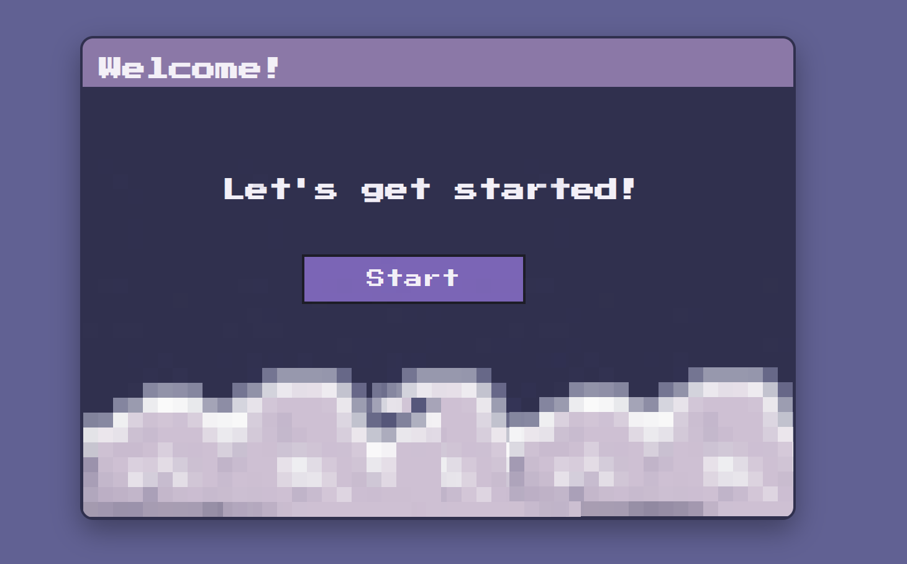
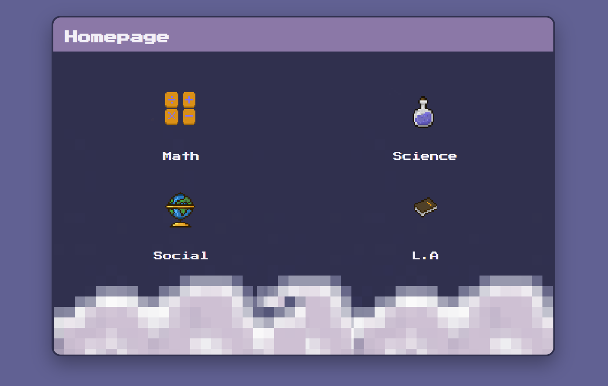
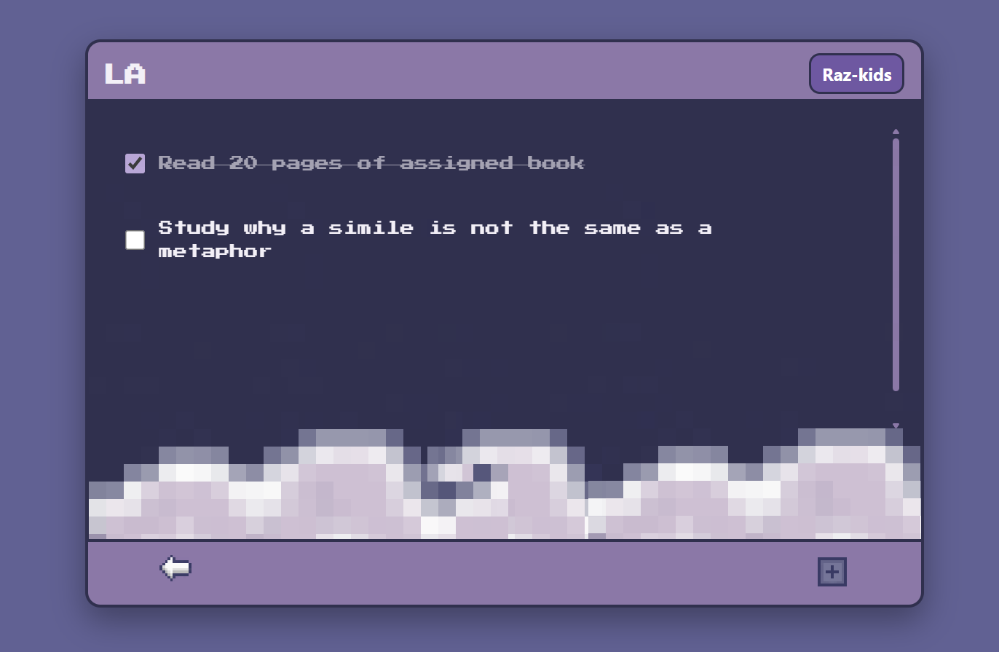

# Pixel Study Planner for Tutoring

A pixel-art styled study planner designed specifically for tutoring elementary school students.  
The interface is intentionally simple, visual, and game-like to make task tracking feel approachable and engaging for younger learners.

## Why I Built This
I tutor elementary students and wanted a tool that:
- Feels fun instead of overwhelming
- Uses clear subject separation (Math, Science, Social, Language Arts)
- Encourages task completion without complex menus
- Looks more like a game than a traditional planner

This project focuses on **clarity, consistency, and visual comfort** rather than advanced features.

## Design & Planning Process

Before writing code, I planned the layout and user flow using **Figma**.  
This helped me decide screen structure, spacing, and visual hierarchy with younger students in mind.

All visual assets (icons and clouds) were hand-designed in **Procreate**, allowing me to create:
- Simple, friendly subject icons
- Soft decorative elements that don’t distract from tasks
- A cohesive pixel-art style across the app

Designing the UI and assets first made the implementation phase more intentional and consistent.

## Features
- Subject-based task lists
- Pixel-art UI for a friendly, non-intimidating feel
- Simple checkbox-based tasks
- Clean navigation between screens
- Designed with younger students in mind

## Tech Stack
- HTML
- CSS
- JavaScript
- Figma (UI planning)
- Procreate (custom icons & pixel art)

## Design Choices
- Pixel fonts and icons to create a playful aesthetic
- Limited color palette to avoid visual overload
- Minimal interactions to keep the UI easy to understand
- Decorative elements (clouds) to soften the interface

## Future Improvements
- Task persistence with local storage
- Animations for feedback when tasks are completed
- Optional “focus mode” with reduced visuals
- Custom themes per subject

## Screenshots

